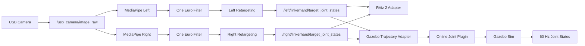

<div align="center">

# LinkerHand Gesture Control Sim

A camera-driven ROS 2 project for real-time Linker Hand L30/O6 gesture simulation

[](https://docs.ros.org/en/humble/)
[](https://releases.ubuntu.com/22.04/)
[](https://www.python.org/)
[](https://developers.google.com/mediapipe)
[](https://github.com/ros2/rviz)
[](https://gazebosim.org/)
[](#project-status)
[](#overview)
[](#validation)
[](#license)
[](https://github.com/2303886347/linkerhand_gesture_control_sim/stargazers)
[](https://github.com/2303886347/linkerhand_gesture_control_sim/issues)
[](https://github.com/2303886347/linkerhand_gesture_control_sim/pulls)

[简体中文](README.md) | [English](README.en.md) | [Chinese operation guide](GUIDE.md) | [Issues](https://github.com/2303886347/linkerhand_gesture_control_sim/issues/new/choose)

</div>

<div align="center">

[](docs/assets/linkhand_demo.mp4)

**Click the image to play the MediaPipe → retargeting → RViz demo**

</div>

## Overview

LinkerHand Gesture Control Sim is a ready-to-run visual gesture simulation project. It
uses an ordinary USB camera to provide a direct experience of real-time Linker Hand L30
and O6 gesture synchronization, angle retargeting, and simulation interaction.

The system captures camera frames, detects left or right hand landmarks with MediaPipe,
computes semantic human joint angles, and applies independent calibration, retargeting,
One Euro filtering, deadband/hysteresis, EMA smoothing, and velocity limits. The final
joint targets drive L30/O6 single-hand or mixed dual-hand models in RViz 2. Gazebo
supports single-left and single-right L30 operation. The O6 single-hand control chain is
connected and pending GUI motion acceptance.

The project is centered on letting users experience real-time Linker Hand gesture
synchronization first. RViz 2 and Gazebo Sim make the complete camera-driven interaction
immediately visible, while the same pipeline supports ROS 2 learning, angle-mapping
experiments, and gesture-algorithm validation. It covers everything from camera capture
and MediaPipe perception to processed joint angles and simulation display.

## Highlights

- Real-time dexterous-hand simulation driven by a standard USB camera.
- L30/O6 single-hand RViz and all four left/right model combinations.
- A parameterized core launcher plus shortcuts for common model pairs.
- Parameterized and shortcut Gazebo launchers for L30/O6 single-hand operation.
- A single camera shared by isolated left and right perception pipelines.
- Independent calibration, topics, joint states, and TF trees for both hands.
- Mirrored preview without changing handedness classification or published data.
- Image-landmark fallback when 3D landmarks temporarily become degenerate.
- One Euro filtering, joint deadband/hysteresis, EMA, and slew-rate limiting.
- Hold-on-dropout behavior followed by a smooth return to the safe open pose.
- ROS 2-ready URDF, meshes, RViz 2, and Gazebo Sim description packages.
- Official O6 assets with six-active-DOF profiles and RViz/Gazebo adaptation.
- Complete single-left and single-right Gazebo pipelines with 60 Hz joint-state feedback.
- Full-target validation, joint speed limits, and independent model correction per hand.
- Chinese source comments and logs with bilingual repository documentation.

## Architecture



## Quick Start

### Requirements

- Ubuntu 22.04
- ROS 2 Humble
- Python 3.10
- MediaPipe, OpenCV, and NumPy
- A USB camera exposed as `/dev/video*`
- RViz 2
- Gazebo Sim 6, `ros_gz_sim`, and `ros_gz_bridge` for Gazebo operation

### Clone and build

```bash
git clone https://github.com/2303886347/linkerhand_gesture_control_sim.git \
  ~/linkerhand_ros2_ws
cd ~/linkerhand_ros2_ws
source /opt/ros/humble/setup.bash
rosdep install --from-paths src --ignore-src -r -y
python3 -m pip install 'mediapipe==0.10.9'
colcon build --symlink-install
source install/setup.bash
```

The complete gesture simulation pipeline can be launched with a computer, a USB camera,
and a working ROS 2 graphical environment.

### Supported modes

| Viewer | Mode | Command |
| --- | --- | --- |
| RViz 2 | Any dual-hand pair | `ros2 launch linkerhand_bringup mediapipe_rviz.launch.py left_model:=l30 right_model:=o6` |
| RViz 2 | L30 left | `ros2 launch linkerhand_retargeting mediapipe_rviz_left.launch.py` |
| RViz 2 | L30 right | `ros2 launch linkerhand_retargeting mediapipe_rviz_right.launch.py` |
| RViz 2 | O6 left | `ros2 launch linkerhand_retargeting mediapipe_rviz_o6_left.launch.py` |
| RViz 2 | O6 right | `ros2 launch linkerhand_retargeting mediapipe_rviz_o6_right.launch.py` |
| Gazebo Sim | L30 left | `ros2 launch linkerhand_gazebo_control mediapipe_gazebo_left.launch.py` |
| Gazebo Sim | L30 right | `ros2 launch linkerhand_gazebo_control mediapipe_gazebo_right.launch.py` |
| Gazebo Sim | O6 left | `ros2 launch linkerhand_bringup mediapipe_gazebo_o6_left.launch.py` |
| Gazebo Sim | O6 right | `ros2 launch linkerhand_bringup mediapipe_gazebo_o6_right.launch.py` |

The dual-hand launcher starts one camera and two MediaPipe workers at 10 FPS per side.
See [GUIDE.md](GUIDE.md) for camera checks, calibration, filter tuning, ROS topic
inspection, and troubleshooting.

Gazebo launchers open both the MediaPipe preview and the Gazebo GUI. Append
`device:=/dev/video2` to any command when the camera is not `/dev/video0`.

## Packages

| Package | Responsibility |
| --- | --- |
| `usb_camera_demo` | USB camera capture and ROS 2 image publishing |
| `hand_pose_msgs` | Hand landmark and semantic joint-angle messages |
| `mediapipe_hand_pose` | MediaPipe detection, preview, and One Euro filtering |
| `linkerhand_bringup` | Parameterized and shortcut L30/O6 multi-model launchers |
| `linkerhand_model_profiles` | Validated model, side, joint-limit, and description registry |
| `linkerhand_retargeting` | Calibration, mapping, EMA, rate limits, and RViz adapters |
| `linkerhand_l30_left_description` | Left L30 URDF, meshes, RViz, and Gazebo launchers |
| `linkerhand_l30_right_description` | Right L30 v6 URDF, meshes, RViz, and Gazebo launchers |
| `linkerhand_o6_left_description` | Official left O6 URDF, meshes, and RViz launcher |
| `linkerhand_o6_right_description` | Official right O6 URDF, meshes, and RViz launcher |
| `linkerhand_gazebo_control` | Trajectory adapter, runtime URDF, state throttle, and Gazebo launchers |
| `linkerhand_gazebo_plugin` | Online multi-joint kinematic position synchronization plugin |

## Branches

`main` is the complete stable project baseline. The focused branches highlight a
specific demonstration entry point without maintaining separate implementations.

| Branch | Purpose |
| --- | --- |
| [`main`](https://github.com/2303886347/linkerhand_gesture_control_sim/tree/main) | Complete stable release |
| [`left-hand`](https://github.com/2303886347/linkerhand_gesture_control_sim/tree/left-hand) | Left-hand demo profile |
| [`right-hand`](https://github.com/2303886347/linkerhand_gesture_control_sim/tree/right-hand) | Right-hand demo profile |
| [`both-hands`](https://github.com/2303886347/linkerhand_gesture_control_sim/tree/both-hands) | Dual-hand demo profile |

## Filtering

The processing chain combines four mechanisms:

1. One Euro filtering for preview landmarks and measured human joint angles.
2. Per-joint deadband and hysteresis lock small static noise until real motion crosses
   the start threshold.
3. EMA smoothing after deadband stabilization.
4. Slew-rate limiting for large changes and a separate safe-return velocity.

The same stabilized targets feed both RViz and Gazebo, giving both viewers consistent
motion behavior.

A useful starting point for stronger static stabilization is:

```bash
ros2 launch linkerhand_bringup mediapipe_rviz.launch.py \
  left_model:=l30 right_model:=o6 \
  one_euro_min_cutoff:=0.5 \
  one_euro_beta:=0.4
```

## Validation

```bash
source /opt/ros/humble/setup.bash
source install/setup.bash
colcon test
colcon test-result --verbose
```

Current baseline: `108 tests, 0 errors, 0 failures, 0 skipped`.

## Project Status

- [x] USB camera ROS 2 publisher
- [x] MediaPipe hand landmarks and semantic angles
- [x] Left, right, and dual-hand RViz synchronization
- [x] L30/O6 model profiles and six-active-DOF O6 retargeting
- [x] Arbitrary L30/O6 left-right pairing through a unified bringup launcher
- [x] Independent calibration and adaptive filtering
- [x] Configurable per-hand joint deadband and hysteresis
- [x] Single-left and single-right Gazebo kinematic position synchronization
- [x] O6 left/right Gazebo control chain and GUI motion acceptance

These features define the complete project scope. The project focuses on driving a
dexterous-hand simulation from an ordinary camera for gesture visualization, ROS 2
learning, retargeting experiments, and interactive demonstrations. Gazebo uses kinematic
position synchronization; contact-oriented applications can extend the existing
interfaces with simplified collision geometry and effort controllers.

## Contributing

Read [CONTRIBUTING.md](CONTRIBUTING.md) before opening a pull request. Bug reports
should include the ROS distribution, camera device, launch command, logs, and exact
reproduction steps.

## License

Licensing is package-specific. The custom ROS 2/Python packages declare Apache-2.0;
the left and right robot description packages declare BSD-3-Clause. Each
`package.xml` is authoritative for its package. Original Linker Hand assets may carry
additional attribution or usage requirements.
