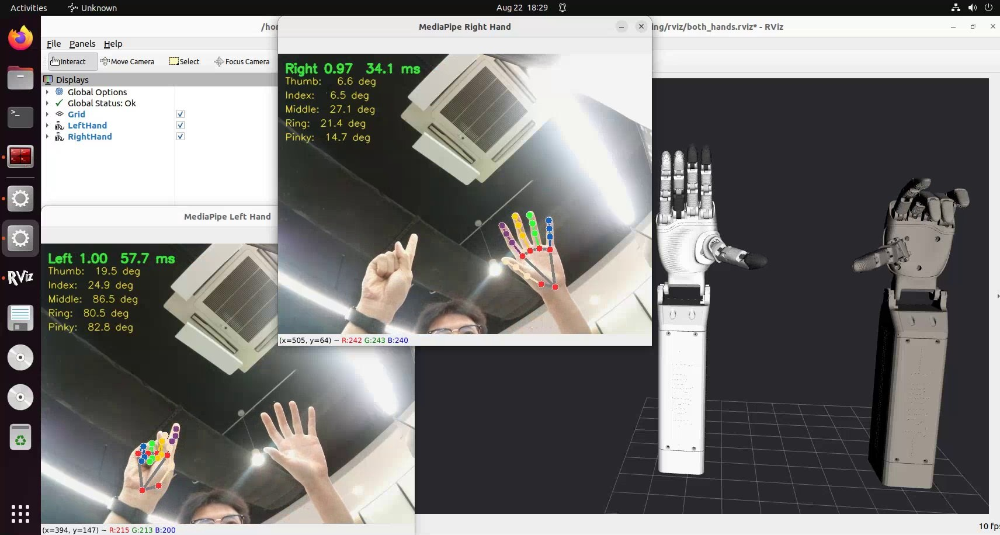

<div align="center">

# LinkerHand Gesture Control Sim

A ROS 2, MediaPipe, and RViz 2 workspace for vision-driven Linker Hand L30 simulation

[](https://docs.ros.org/en/humble/)
[](https://releases.ubuntu.com/22.04/)
[](https://www.python.org/)
[](https://developers.google.com/mediapipe)
[](https://github.com/ros2/rviz)
[](#validation)
[](#license)

[简体中文](README.md) | [English](README.en.md) | [Chinese operation guide](GUIDE.md) | [Issues](https://github.com/2303886347/linkerhand_gesture_control_sim/issues/new/choose)

</div>

<div align="center">

[](docs/assets/linkhand_demo.mp4)

**Click the image to play the MediaPipe → retargeting → RViz demo**

</div>

## Overview

This project turns frames from a USB camera into joint targets for Linker Hand L30
simulation. MediaPipe detects hand landmarks and semantic joint angles. A dedicated
retargeting layer applies per-hand calibration, angle mapping, adaptive filtering, and
velocity limits before publishing the left, right, or dual-hand state to RViz 2.

The current milestone covers the complete camera-to-RViz loop. It does not command
physical hardware, and gesture targets are not yet connected to Gazebo controllers.
The description packages do include standalone RViz and Gazebo Sim model launchers.

## Highlights

- One-command launchers for left-hand, right-hand, and dual-hand operation.
- A single camera shared by isolated left and right perception pipelines.
- Independent calibration, topics, joint states, and TF trees for both hands.
- Mirrored preview without changing handedness classification or published data.
- One Euro landmark/angle filtering, EMA target smoothing, and slew-rate limiting.
- Hold-on-dropout behavior followed by a smooth return to the safe open pose.
- ROS 2-ready URDF, meshes, RViz 2, and Gazebo Sim description packages.
- Chinese source comments and logs with bilingual repository documentation.

## Architecture

```mermaid
flowchart LR
    CAM[USB Camera] --> IMG[/usb_camera/image_raw]
    IMG --> MPL[MediaPipe Left]
    IMG --> MPR[MediaPipe Right]
    MPL --> FL[One Euro Filter]
    MPR --> FR[One Euro Filter]
    FL --> RL[Left Retargeting]
    FR --> RR[Right Retargeting]
    RL --> JL[/left/joint_states]
    RR --> JR[/right/joint_states]
    JL --> RVIZ[RViz 2]
    JR --> RVIZ
```

## Quick Start

### Requirements

- Ubuntu 22.04
- ROS 2 Humble
- Python 3.10
- MediaPipe, OpenCV, and NumPy
- A USB camera exposed as `/dev/video*`
- RViz 2; Gazebo Sim is optional

### Clone and build

```bash
git clone https://github.com/2303886347/linkerhand_gesture_control_sim.git \
  ~/linkerhand_ros2_ws
cd ~/linkerhand_ros2_ws
source /opt/ros/humble/setup.bash
colcon build --symlink-install
source install/setup.bash
```

### Launch modes

```bash
# Left hand
ros2 launch linkerhand_retargeting mediapipe_rviz_left.launch.py

# Right hand
ros2 launch linkerhand_retargeting mediapipe_rviz_right.launch.py

# Both hands in one RViz instance
ros2 launch linkerhand_retargeting mediapipe_rviz_both.launch.py
```

The dual-hand launcher starts one camera and two MediaPipe workers at 10 FPS per side.
See [GUIDE.md](GUIDE.md) for camera checks, calibration, filter tuning, ROS topic
inspection, and troubleshooting.

## Packages

| Package | Responsibility |
| --- | --- |
| `usb_camera_demo` | USB camera capture and ROS 2 image publishing |
| `hand_pose_msgs` | Hand landmark and semantic joint-angle messages |
| `mediapipe_hand_pose` | MediaPipe detection, preview, and One Euro filtering |
| `linkerhand_retargeting` | Calibration, mapping, EMA, rate limits, and RViz adapters |
| `linkerhand_l30_left_description` | Left L30 URDF, meshes, RViz, and Gazebo launchers |
| `linkerhand_l30_right_description` | Right L30 v6 URDF, meshes, RViz, and Gazebo launchers |

## Branches

`main` remains the canonical branch containing all three modes. The focused branches
are lightweight demonstration profiles and do not maintain separate implementations.

| Branch | Purpose |
| --- | --- |
| [`main`](https://github.com/2303886347/linkerhand_gesture_control_sim/tree/main) | Complete workspace and active development |
| [`left-hand`](https://github.com/2303886347/linkerhand_gesture_control_sim/tree/left-hand) | Left-hand demo profile |
| [`right-hand`](https://github.com/2303886347/linkerhand_gesture_control_sim/tree/right-hand) | Right-hand demo profile |
| [`both-hands`](https://github.com/2303886347/linkerhand_gesture_control_sim/tree/both-hands) | Dual-hand demo profile |

## Filtering

The processing chain combines three mechanisms:

1. One Euro filtering for preview landmarks and measured human joint angles.
2. EMA smoothing after mapping human angles to robot targets.
3. Slew-rate limiting for large changes and a separate safe-return velocity.

A useful starting point for stronger static stabilization is:

```bash
ros2 launch linkerhand_retargeting mediapipe_rviz_both.launch.py \
  one_euro_min_cutoff:=0.5 \
  one_euro_beta:=0.4
```

## Validation

```bash
source /opt/ros/humble/setup.bash
source install/setup.bash
colcon test --packages-select mediapipe_hand_pose linkerhand_retargeting
colcon test-result --verbose
```

Current baseline: `21 tests, 0 errors, 0 failures`.

## Roadmap

- [x] USB camera ROS 2 publisher
- [x] MediaPipe hand landmarks and semantic angles
- [x] Left, right, and dual-hand RViz synchronization
- [x] Independent calibration and adaptive filtering
- [ ] Joint deadband and hysteresis
- [ ] Gazebo controller synchronization
- [ ] Physical Linker Hand adapter
- [ ] Recording, playback, and quantitative jitter evaluation

## Contributing

Read [CONTRIBUTING.md](CONTRIBUTING.md) before opening a pull request. Bug reports
should include the ROS distribution, camera device, launch command, logs, and exact
reproduction steps.

## License

Licensing is package-specific. The custom ROS 2/Python packages declare Apache-2.0;
the left and right robot description packages declare BSD-3-Clause. Each
`package.xml` is authoritative for its package. Original Linker Hand assets may carry
additional attribution or usage requirements.
