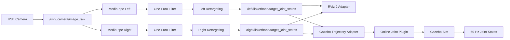

<div align="center">

# LinkerHand Gesture Control Sim

使用普通 USB 摄像头体验 Linker Hand L30 实时手势同步的 ROS 2 仿真项目

[](https://docs.ros.org/en/humble/)
[](https://releases.ubuntu.com/22.04/)
[](https://www.python.org/)
[](https://developers.google.com/mediapipe)
[](https://github.com/ros2/rviz)
[](https://gazebosim.org/)
[](#项目完成状态)
[](#项目简介)
[](#验证与测试)
[](#许可证)
[](https://github.com/2303886347/linkerhand_gesture_control_sim/stargazers)
[](https://github.com/2303886347/linkerhand_gesture_control_sim/issues)
[](https://github.com/2303886347/linkerhand_gesture_control_sim/pulls)

[简体中文](README.md) | [English](README.en.md) | [调试与运行手册](GUIDE.md) | [提交问题](https://github.com/2303886347/linkerhand_gesture_control_sim/issues/new/choose)

</div>

<div align="center">

<a href="docs/assets/linkhand_demo.mp4">
  
</a>

**点击图片播放 MediaPipe → 角度重定向 → RViz 同步演示**

</div>

## 项目简介

LinkerHand Gesture Control Sim 是一个可直接运行的视觉手势仿真项目。它让用户通过
普通 USB 摄像头快速体验 Linker Hand L30 的实时手势同步、角度重定向和仿真交互。

系统从摄像头获取画面，使用 MediaPipe 检测左右手关键点并计算人体关节角，再经过
左右手独立标定、角度重定向、One Euro、死区/迟滞、EMA 和速度限制，最终驱动
RViz 2 或 Gazebo Sim 中的 Linker Hand 模型。RViz 支持左手、右手和双手显示；
Gazebo 支持单左手和单右手位置同步，并反馈实际仿真关节状态。

项目定位是仿真优先的灵巧手视觉交互、ROS 2 学习和手势算法体验。它完整覆盖摄像头
采集、MediaPipe 感知、角度处理到 RViz/Gazebo 显示的数据链路。

## 核心能力

- 普通 USB 摄像头驱动的实时灵巧手仿真体验。
- RViz 左手、右手、双手三套一键启动入口。
- Gazebo 单左手、单右手一键启动入口。
- 双手模式只打开一次摄像头，左右识别、标定、话题和 TF 完全隔离。
- 左右手使用独立的实测输入范围与机械手角度映射。
- 调试画面支持镜像显示，不改变左右手判定和输出数据。
- 3D 关键点短时退化时回退到图像关键点，避免控制链误判丢失。
- One Euro、关节死区/迟滞、EMA 和关节速度限制。
- 目标丢失后短暂保持，并平滑返回安全开掌姿态。
- L30 左右手 URDF、mesh、RViz 2 和 Gazebo Sim 描述包。
- Gazebo 视觉同步与 60 Hz 实际关节状态反馈。
- Gazebo 输入完整性检查、关节限速和左右手独立模型参数校正。
- 中文源码注释、中文运行日志以及中英双语项目文档。

## 系统架构



```text
摄像头 -> MediaPipe -> One Euro -> 人体关节角 -> 左右手标定映射
       -> 死区/迟滞 + EMA + 限速 -> RViz 2 或 Gazebo Sim
```

## 快速开始

### 环境要求

- Ubuntu 22.04
- ROS 2 Humble
- Python 3.10
- MediaPipe、OpenCV、NumPy
- 可用的 `/dev/video*` USB 摄像头
- RViz 2
- Gazebo Sim 6、`ros_gz_sim` 和 `ros_gz_bridge`（运行 Gazebo 模式时）

### 获取与构建

```bash
git clone https://github.com/2303886347/linkerhand_gesture_control_sim.git \
  ~/linkerhand_ros2_ws
cd ~/linkerhand_ros2_ws
source /opt/ros/humble/setup.bash
rosdep install --from-paths src --ignore-src -r -y
python3 -m pip install 'mediapipe==0.10.9'
colcon build --symlink-install
source install/setup.bash
```

准备电脑、USB 摄像头和 ROS 2 图形环境后，即可运行完整手势仿真链路。

### 支持的运行模式

| 显示端 | 模式 | 命令 |
| --- | --- | --- |
| RViz 2 | 左手 | `ros2 launch linkerhand_retargeting mediapipe_rviz_left.launch.py` |
| RViz 2 | 右手 | `ros2 launch linkerhand_retargeting mediapipe_rviz_right.launch.py` |
| RViz 2 | 双手 | `ros2 launch linkerhand_retargeting mediapipe_rviz_both.launch.py` |
| Gazebo Sim | 左手 | `ros2 launch linkerhand_gazebo_control mediapipe_gazebo_left.launch.py` |
| Gazebo Sim | 右手 | `ros2 launch linkerhand_gazebo_control mediapipe_gazebo_right.launch.py` |

双手模式默认每侧以 10 FPS 运行一个 MediaPipe 实例。CPU 余量充足时可以提高：

```bash
ros2 launch linkerhand_retargeting mediapipe_rviz_both.launch.py \
  processing_fps:=12.0
```

更完整的设备检查、参数解释、标定范围、滤波调节和故障排查见
[GUIDE.md](GUIDE.md)。

Gazebo 入口会同时打开 MediaPipe 预览和 Gazebo GUI。摄像头不是 `/dev/video0` 时，
在任意启动命令后追加 `device:=/dev/video2`。

## ROS 2 包

| 包 | 作用 | 文档 |
| --- | --- | --- |
| `usb_camera_demo` | 打开 USB 摄像头并发布 ROS 2 图像 | [README](src/usb_camera_demo/README.md) |
| `hand_pose_msgs` | 定义手部关键点和语义关节角消息 | [README](src/hand_pose_msgs/README.md) |
| `mediapipe_hand_pose` | MediaPipe 检测、骨架显示和 One Euro 滤波 | [README](src/mediapipe_hand_pose/README.md) |
| `linkerhand_retargeting` | 标定映射、EMA、限速、回零和双手 RViz | [README](src/linkerhand_retargeting/README.md) |
| `linkerhand_l30_left_description` | L30 左手 URDF、mesh、RViz/Gazebo 启动 | [README](src/linkerhand_l30_left_description/README.md) |
| `linkerhand_l30_right_description` | L30 v6 右手 URDF、mesh、RViz/Gazebo 启动 | [README](src/linkerhand_l30_right_description/README.md) |
| `linkerhand_gazebo_control` | 轨迹适配、动态 URDF、状态节流和 Gazebo 启动 | [README](src/linkerhand_gazebo_control/README.md) |
| `linkerhand_gazebo_plugin` | Gazebo 在线多关节运动学位置同步插件 | [README](src/linkerhand_gazebo_plugin/README.md) |

## 分支说明

`main` 是完整、稳定的项目基线，包含所有已交付功能。以下分支用于突出对应演示入口，
核心代码仍从 `main` 同步，避免左右手实现分叉。

| 分支 | 用途 |
| --- | --- |
| [`main`](https://github.com/2303886347/linkerhand_gesture_control_sim/tree/main) | 完整稳定版本 |
| [`left-hand`](https://github.com/2303886347/linkerhand_gesture_control_sim/tree/left-hand) | 左手演示配置 |
| [`right-hand`](https://github.com/2303886347/linkerhand_gesture_control_sim/tree/right-hand) | 右手演示配置 |
| [`both-hands`](https://github.com/2303886347/linkerhand_gesture_control_sim/tree/both-hands) | 双手演示配置 |

## 滤波

手势链路不是简单的固定低通，而是四层稳定化处理：

1. One Euro 对调试骨架关键点和人体关节角进行自适应滤波。
2. 关节死区与迟滞锁住静止小噪声，并在真实动作越过启动阈值后恢复跟随。
3. EMA 对消抖后的机械手目标再次平滑。
4. 速度限制抑制异常的大幅跳变，并单独控制目标丢失后的回零速度。

同一套稳定化结果同时供 RViz 和 Gazebo 使用，因此两种显示端具有一致的动作响应。

推荐从以下参数开始调整静止抖动：

```bash
ros2 launch linkerhand_retargeting mediapipe_rviz_both.launch.py \
  one_euro_min_cutoff:=0.5 \
  one_euro_beta:=0.4
```

## 验证与测试

```bash
cd ~/linkerhand_ros2_ws
source /opt/ros/humble/setup.bash
source install/setup.bash
colcon test
colcon test-result --verbose
```

当前验证基线：`40 tests, 0 errors, 0 failures, 0 skipped`。

## 项目完成状态

- [x] USB 摄像头 ROS 2 图像发布
- [x] MediaPipe 左右手关键点与关节角
- [x] 左手、右手、双手 RViz 同步
- [x] 独立标定、One Euro、EMA 和回零限速
- [x] 可配置的左右手独立关节死区与迟滞消抖
- [x] Gazebo 单左手、单右手运动学位置反馈同步

以上功能构成项目的完整交付范围。项目专注于“普通摄像头驱动灵巧手仿真显示”，适合
手势可视化、ROS 2 学习、角度映射调试和交互演示。Gazebo 使用运动学位置反馈同步；
面向接触物理的应用可以在现有接口上扩展简化碰撞体和 effort 控制器。

## 贡献

提交代码前请阅读 [CONTRIBUTING.md](CONTRIBUTING.md)。问题报告请包含 ROS 2 版本、
摄像头设备、启动命令、终端日志以及可复现步骤。

## 许可证

仓库采用包级许可证：自主开发的 ROS 2/Python 包声明为 Apache-2.0，左右手模型描述包
声明为 BSD-3-Clause。各目录中的 `package.xml` 是对应包许可证的权威来源。模型和
mesh 的使用还应遵循原始 Linker Hand 资源的授权与署名要求。

## 致谢

- [ROS 2](https://docs.ros.org/en/humble/)
- [MediaPipe](https://developers.google.com/mediapipe)
- [Linker Hand](https://linkerhand.com/)
