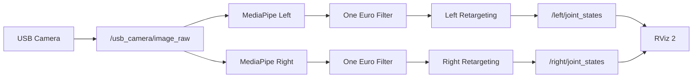

<div align="center">

# LinkerHand Gesture Control Sim

基于 ROS 2、MediaPipe 与 RViz 2 的 Linker Hand L30 左右手手势同步仿真工作空间

[](https://docs.ros.org/en/humble/)
[](https://releases.ubuntu.com/22.04/)
[](https://www.python.org/)
[](https://developers.google.com/mediapipe)
[](https://github.com/ros2/rviz)
[](#验证与测试)
[](#许可证)
[](https://github.com/2303886347/linkerhand_gesture_control_sim/stargazers)
[](https://github.com/2303886347/linkerhand_gesture_control_sim/issues)
[](https://github.com/2303886347/linkerhand_gesture_control_sim/pulls)

[简体中文](README.md) | [English](README.en.md) | [调试与运行手册](GUIDE.md) | [提交问题](https://github.com/2303886347/linkerhand_gesture_control_sim/issues/new/choose)

</div>

<div align="center">

双手手势MediaPipe → 角度映射 → RViz 同步演示同步演示:


https://github.com/user-attachments/assets/42c7ba90-533e-4c96-a445-143ad9f55d39


</div>

## 项目简介

该项目将 USB 摄像头画面转换为可用于 Linker Hand L30 仿真的关节目标：MediaPipe
负责识别人手关键点和语义关节角，重定向节点完成左右手独立标定、角度映射、滤波
与限速，最后通过 RViz 2 同步显示左手、右手或双手模型。

当前阶段聚焦视觉到 RViz 的完整闭环，不包含真实机械手控制器，也尚未把手势目标接入
Gazebo 控制器。URDF 描述包已经提供独立的 RViz 和 Gazebo Sim 模型启动入口。

## 核心能力

- 左手、右手、双手三套一键启动入口。
- 双手模式只打开一次摄像头，左右识别、标定、话题和 TF 完全隔离。
- 左右手使用独立的实测输入范围与机械手角度映射。
- 调试画面支持镜像显示，不改变左右手判定和输出数据。
- One Euro 关键点/角度滤波、EMA 目标滤波和关节速度限制。
- 目标丢失后短暂保持，并平滑返回安全开掌姿态。
- L30 左右手 URDF、mesh、RViz 2 和 Gazebo Sim 描述包。
- 中文源码注释、中文运行日志以及中英双语项目文档。

## 系统架构



```text
摄像头 -> MediaPipe -> 人体关节角 -> 左右手标定映射
       -> One Euro + EMA + 限速 -> JointState -> RViz 2
```

## 快速开始

### 环境要求

- Ubuntu 22.04
- ROS 2 Humble
- Python 3.10
- MediaPipe、OpenCV、NumPy
- 可用的 `/dev/video*` USB 摄像头
- RViz 2；Gazebo Sim 为可选依赖

### 获取与构建

```bash
git clone https://github.com/2303886347/linkerhand_gesture_control_sim.git \
  ~/linkerhand_ros2_ws
cd ~/linkerhand_ros2_ws
source /opt/ros/humble/setup.bash
colcon build --symlink-install
source install/setup.bash
```

### 运行模式

| 模式 | 命令 | 标定文件 |
| --- | --- | --- |
| 左手 | `ros2 launch linkerhand_retargeting mediapipe_rviz_left.launch.py` | `retargeting_left.yaml` |
| 右手 | `ros2 launch linkerhand_retargeting mediapipe_rviz_right.launch.py` | `retargeting_right.yaml` |
| 双手 | `ros2 launch linkerhand_retargeting mediapipe_rviz_both.launch.py` | 左右独立加载 |

双手模式默认每侧以 10 FPS 运行一个 MediaPipe 实例。CPU 余量充足时可以提高：

```bash
ros2 launch linkerhand_retargeting mediapipe_rviz_both.launch.py \
  processing_fps:=12.0
```

更完整的设备检查、参数解释、标定范围、滤波调节和故障排查见
[GUIDE.md](GUIDE.md)。

## ROS 2 包

| 包 | 作用 | 文档 |
| --- | --- | --- |
| `usb_camera_demo` | 打开 USB 摄像头并发布 ROS 2 图像 | [README](src/usb_camera_demo/README.md) |
| `hand_pose_msgs` | 定义手部关键点和语义关节角消息 | [README](src/hand_pose_msgs/README.md) |
| `mediapipe_hand_pose` | MediaPipe 检测、骨架显示和 One Euro 滤波 | [README](src/mediapipe_hand_pose/README.md) |
| `linkerhand_retargeting` | 标定映射、EMA、限速、回零和双手 RViz | [README](src/linkerhand_retargeting/README.md) |
| `linkerhand_l30_left_description` | L30 左手 URDF、mesh、RViz/Gazebo 启动 | [README](src/linkerhand_l30_left_description/README.md) |
| `linkerhand_l30_right_description` | L30 v6 右手 URDF、mesh、RViz/Gazebo 启动 | [README](src/linkerhand_l30_right_description/README.md) |

## 分支说明

`main` 是唯一的完整开发基线，同时包含三种运行模式。以下分支只作为对应模式的演示
入口，核心代码仍从 `main` 同步，避免左右手实现长期分叉。

| 分支 | 用途 |
| --- | --- |
| [`main`](https://github.com/2303886347/linkerhand_gesture_control_sim/tree/main) | 完整功能与持续开发 |
| [`left-hand`](https://github.com/2303886347/linkerhand_gesture_control_sim/tree/left-hand) | 左手演示配置 |
| [`right-hand`](https://github.com/2303886347/linkerhand_gesture_control_sim/tree/right-hand) | 右手演示配置 |
| [`both-hands`](https://github.com/2303886347/linkerhand_gesture_control_sim/tree/both-hands) | 双手演示配置 |

## 滤波

当前链路不是简单的固定低通，而是三层处理：

1. One Euro 对调试骨架关键点和人体关节角进行自适应滤波。
2. EMA 对映射后的机械手目标再次平滑。
3. 速度限制抑制异常的大幅跳变，并单独控制目标丢失后的回零速度。

推荐从以下参数开始调整静止抖动：

```bash
ros2 launch linkerhand_retargeting mediapipe_rviz_both.launch.py \
  one_euro_min_cutoff:=0.5 \
  one_euro_beta:=0.4
```

## 验证与测试

```bash
cd ~/linkerhand_ros2_ws
source /opt/ros/humble/setup.bash
source install/setup.bash
colcon test --packages-select mediapipe_hand_pose linkerhand_retargeting
colcon test-result --verbose
```

当前验证基线：`21 tests, 0 errors, 0 failures`。

## 路线图

- [x] USB 摄像头 ROS 2 图像发布
- [x] MediaPipe 左右手关键点与关节角
- [x] 左手、右手、双手 RViz 同步
- [x] 独立标定、One Euro、EMA 和回零限速
- [ ] 关节死区与迟滞消抖
- [ ] Gazebo 控制器闭环同步
- [ ] 真实 Linker Hand 控制适配器
- [ ] 录制、回放和定量抖动评估工具

## 贡献

提交代码前请阅读 [CONTRIBUTING.md](CONTRIBUTING.md)。问题报告请包含 ROS 2 版本、
摄像头设备、启动命令、终端日志以及可复现步骤。

## 许可证

仓库采用包级许可证：自主开发的 ROS 2/Python 包声明为 Apache-2.0，左右手模型描述包
声明为 BSD-3-Clause。各目录中的 `package.xml` 是对应包许可证的权威来源。模型和
mesh 的使用还应遵循原始 Linker Hand 资源的授权与署名要求。

## 致谢

- [ROS 2](https://docs.ros.org/en/humble/)
- [MediaPipe](https://developers.google.com/mediapipe)
- [Linker Hand](https://linkerhand.com/)
